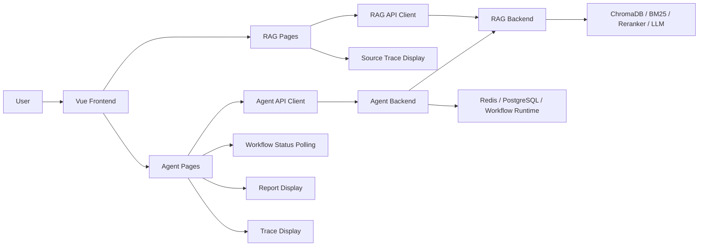
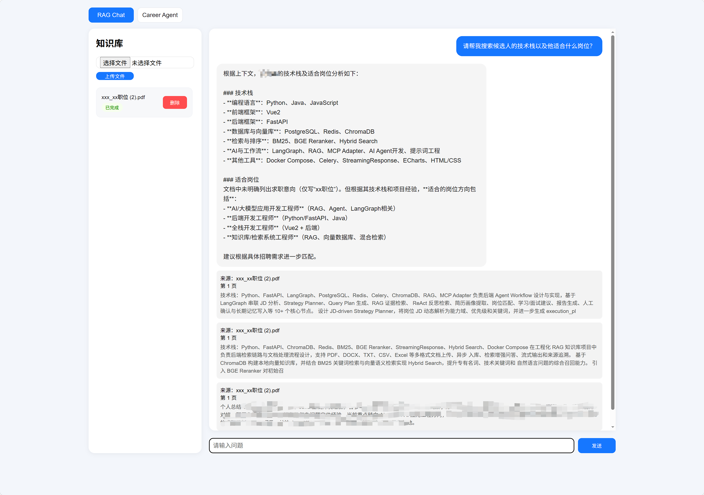
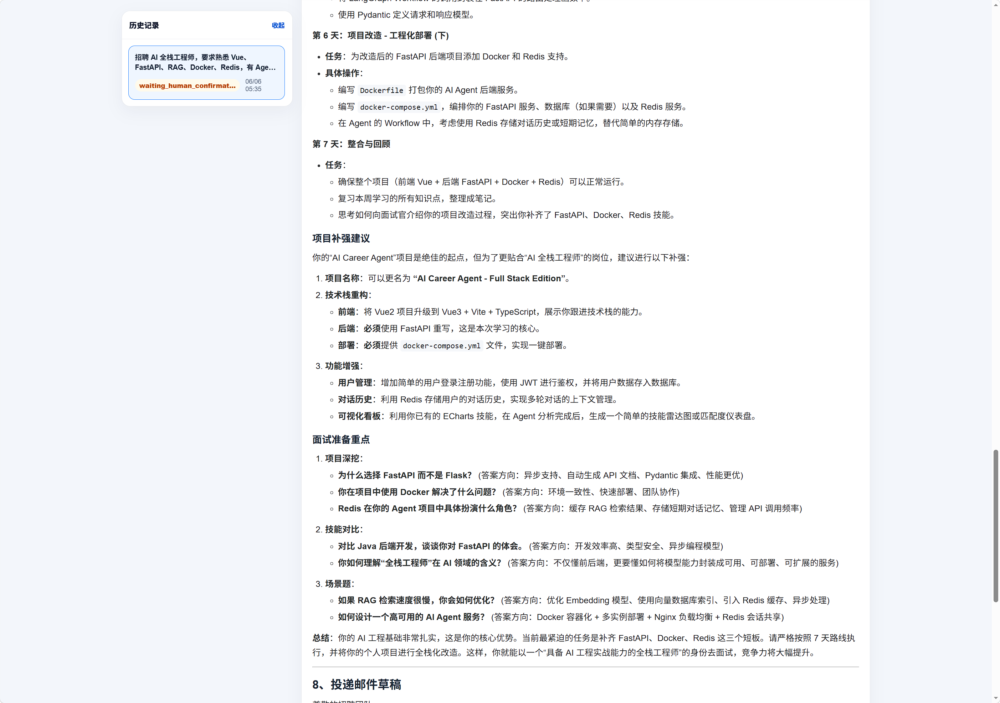

# AI Agent RAG Frontend

Personal Project / 个人独立项目：一个基于 Vue 3 + Vite 的前端，用于连接 RAG 知识库后端与 AI Career Agent 后端，展示文档问答、来源追溯、JD 分析任务提交、状态轮询和报告展示流程。

## 1. Project Overview / 项目简介

`ai-agent-rag-frontend` 是一个个人独立开发的 AI 应用前端项目。它不是生产级商业 SaaS，也不包含后端检索、Agent Workflow 执行或复杂权限系统。

当前前端主要用于验证以下闭环：

- 上传文档并查看文档处理状态；
- 调用 RAG 后端进行知识库问答；
- 展示 RAG 回答对应的 source documents；
- 向 Career Agent 后端提交 JD 与简历文本；
- 通过 `workflow_id` 轮询异步分析任务状态；
- 展示 Agent 生成的 Markdown 报告；
- 查看 Agent workflow 的 trace / tool call 信息；
- 通过环境变量配置 RAG API 与 Agent API 地址，方便多仓库本地联调。

## 2. Repository Role / 当前仓库定位

相关仓库：

- Frontend: <https://github.com/Joker3e3/ai-agent-rag-frontend>
- RAG Backend: <https://github.com/Joker3e3/ai-rag-knowledge-base-backend>
- Agent Backend: <https://github.com/Joker3e3/ai-career-agent-backend>

调用关系：

- 当前仓库是 Vue 前端，只负责页面展示、表单提交、状态轮询和结果渲染；
- 前端调用 RAG Backend 完成文档上传、文档列表查询、文档删除、知识库问答和来源追溯；
- 前端调用 Agent Backend 提交 JD 分析任务、查询 workflow 状态、确认人工节点、查看历史任务和 trace；
- Agent Backend 可在自身 workflow 中继续调用 RAG Backend；
- 当前仓库不包含 RAG 检索逻辑，也不执行 Agent Workflow。

## 3. Architecture / 系统架构



## 4. 多仓库启动顺序

当前系统由以下三个仓库共同组成：

1. 启动 RAG 知识库后端：`ai-rag-knowledge-base-backend`

   默认地址：`http://localhost:8000`

2. 启动 Agent 后端：`ai-career-agent-backend`

   默认地址：`http://localhost:8001`

3. 启动前端项目：`ai-agent-rag-frontend`

   默认地址：`http://localhost:5173`

### 服务依赖关系

- 前端通过 `VITE_API_BASE_URL` 调用 RAG 知识库后端；
- 前端通过 `VITE_AGENT_BASE_URL` 调用 Agent 后端；
- Agent 后端通过自身配置，例如 `RAG_SERVICE_URL`，调用 RAG 后端。

### 整体调用链路

```text
RAG 问答链路：
Vue Frontend
    ↓
RAG Backend
    ↓
ChromaDB / BM25 / Reranker / LLM

Agent 分析链路：
Vue Frontend
    ↓
Agent Backend
    ↓
RAG Backend
    ↓
Agent Report
```

## 5. Core Features / 核心功能

- 文档上传：通过 RAG Backend 的 `/upload` 接口上传文件；
- 文档状态展示：通过 `/documents` 查询文档列表和处理状态；
- 文档删除：通过 `/delete_document` 删除指定文档；
- RAG 问答：通过 `/chat_stream` 获取流式回答；
- 来源追溯：通过 `/sources_history` 展示回答引用的文档片段；
- JD 分析任务提交：通过 Agent Backend 的 `/career_agent/analyze` 提交 JD 和简历文本；
- workflow 状态轮询：通过 `/career_agent/runs/{workflow_id}` 查询异步任务状态；
- Agent 报告与 trace 展示：渲染 Markdown 报告，并通过 `/career_agent/runs/{workflow_id}/trace` 查看执行步骤和 tool calls。

## 6. Tech Stack / 技术栈

Frontend:

- Vue 3
- Vite
- JavaScript
- Vue Router
- Element Plus
- Axios
- Fetch API
- markdown-it

Backend Integration:

- RAG Backend API
- Agent Backend API
- Streaming response for RAG chat
- Polling for Agent workflow status

Infra:

- npm
- Dockerfile + Docker Compose for frontend static deployment
- Nginx static file serving in Docker image

## 7. Project Structure / 目录结构

```text
ai-agent-rag-frontend/
├── public/
│   └── favicon.ico
├── src/
│   ├── components/
│   │   └── TracePanel.vue
│   ├── router/
│   │   └── index.js
│   ├── views/
│   │   ├── CareerAgent.vue
│   │   └── RagChatView.vue
│   ├── App.vue
│   └── main.js
├── .env.development
├── .env.production
├── Dockerfile
├── docker-compose.yml
├── package.json
├── vite.config.js
└── README.md
```

关键文件说明：

- `src/main.js`：创建 Vue 应用，注册 Element Plus 和 Vue Router；
- `src/App.vue`：应用外层布局与顶部导航；
- `src/router/index.js`：路由配置，包含 `/rag-chat` 和 `/career-agent`；
- `src/views/RagChatView.vue`：RAG 文档上传、文档状态、问答和来源展示页面；
- `src/views/CareerAgent.vue`：JD 分析提交、workflow 状态轮询、报告、历史记录和确认操作页面；
- `src/components/TracePanel.vue`：Agent workflow trace 展示组件；
- `.env.development` / `.env.production`：前端读取的 API base URL 配置；
- `Dockerfile` / `docker-compose.yml`：构建前端静态资源并通过 Nginx 暴露。

当前没有单独的 Pinia / Vuex 状态管理目录，页面状态主要维护在各自的 Vue component 内。

## 8. Quick Start / 快速启动

```bash
git clone https://github.com/Joker3e3/ai-agent-rag-frontend.git
cd ai-agent-rag-frontend
npm install
```

复制 .env.example：

cp .env.example .env：

```env
VITE_API_BASE_URL=http://localhost:8000
VITE_AGENT_BASE_URL=http://localhost:8001
```

启动开发服务：

```bash
npm run dev
```

浏览器访问：

```text
http://localhost:5173
```

### Docker

当前 Docker 配置用于构建并运行前端静态页面：

```bash
docker compose up -d --build
```

访问地址：

```text
http://localhost:5173
```

停止服务：

```bash
docker compose down
```

注意：当前 `docker-compose.yml` 只包含前端服务，不会启动 RAG Backend 或 Agent Backend。运行 Docker 前请确认后端服务已经可访问，并确认构建时使用的前端环境变量符合你的本地地址。

## 9. Environment Variables / 环境变量

当前代码实际读取的环境变量如下：

| Variable | Default example | Used by | Purpose |
| --- | --- | --- | --- |
| `VITE_API_BASE_URL` | `http://localhost:8000` | `src/views/RagChatView.vue` | RAG Backend API base URL |
| `VITE_AGENT_BASE_URL` | `http://localhost:8001` | `src/views/CareerAgent.vue` | Agent Backend API base URL |

说明：当前代码没有读取 `VITE_RAG_API_BASE_URL` 或 `VITE_AGENT_API_BASE_URL`。如果后续希望使用这两个更明确的变量名，需要同步修改源码中的 `import.meta.env` 读取逻辑。

## 10. Main Pages / 主要页面

- `/rag-chat`：RAG Chat 页面，调用 RAG Backend。
  - 上传文档：`POST /upload`
  - 查询文档：`GET /documents`
  - 删除文档：`DELETE /delete_document`
  - 流式问答：`POST /chat_stream`
  - 来源追溯：`POST /sources_history`

- `/career-agent`：Career Agent 页面，调用 Agent Backend。
  - 提交分析任务：`POST /career_agent/analyze`
  - 查询历史任务：`GET /career_agent/runs`
  - 查询 workflow 状态：`GET /career_agent/runs/{workflow_id}`
  - 人工确认：`POST /career_agent/confirm`
  - 查询 trace：`GET /career_agent/runs/{workflow_id}/trace`

## 11. Design Notes / 设计说明

1. 将 RAG 页面和 Agent 页面放在同一个前端项目中，是为了用同一套入口演示从知识库问答到 Agent 分析的完整 AI 应用链路。

2. Agent 分析是长耗时任务，前端提交任务后不会阻塞等待，而是保存后端返回的 `workflow_id`，再定时查询任务状态并更新页面。

3. RAG 回答需要可解释性，所以页面在回答完成后继续请求 source documents，让用户看到答案来自哪些文档片段。

4. Agent workflow 涉及多个执行节点和工具调用，trace 面板用于展示步骤、状态、耗时和 tool calls，便于理解流程和调试问题。

5. RAG API 与 Agent API 使用环境变量配置，方便本地开发、Docker 构建和多仓库联调时切换服务地址。

## 12. Demo Screenshots

### RAG Upload


### RAG Chat



### JD Analysis Submit


### Agent Report




## 13. Current Limitations / 当前边界

- Personal project, not production-grade；
- 当前没有完整登录认证；
- 当前没有复杂权限系统或 RBAC；
- 当前主要用于本地演示、项目展示和多仓库联调；
- 当前前端依赖 RAG Backend 与 Agent Backend 均正常启动；
- 如果 API base URL 配置错误，页面请求会失败；
- 前端页面中仍存在演示用默认 `user_id` / `session_id`；
- 当前不是完整商业 SaaS 前端平台。

## 14. Roadmap / 后续计划

- 增加更完整的错误提示和空状态展示；
- 增加 loading / retry / cancel 等任务交互；
- 优化 Agent trace 的可视化层级；
- 增加报告导出 Markdown / PDF；
- 补充用户登录与会话管理；
- 增加三仓库统一启动或 Docker Compose 联调文档；
- 优化移动端适配。

## 15. Security Notes / 安全说明

- `.env` 不应提交到 Git；
- `.env.example` 只应保留可公开的占位符和本地默认地址；
- 前端项目中不应放置任何后端密钥或 LLM API key；
- 后端 API key 只应存放在对应后端服务的环境变量中；
- 已检查 `.gitignore`：当前已忽略 `.env`、`node_modules` 和 `dist`。

